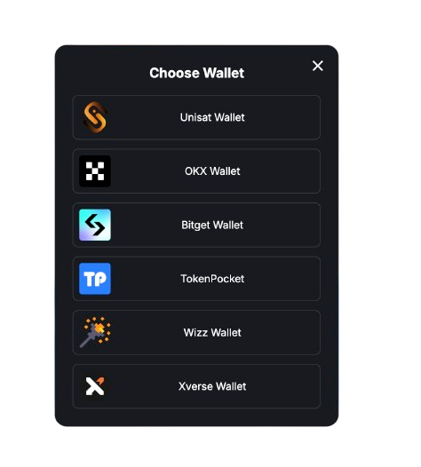

<Frame>
  
</Frame>

## Particle’s Onboarding SDKs

**Particle Network** offers a set of onboarding tools built for modern Web3 UX—combining social login, wallet connection, and smart account infrastructure.

This page aggregates all relevant resources for each SDK.

## Particle Connect

<Frame caption="Particle Connect Login Modal">
  
</Frame>

**Particle Connect** provides a unified modal for both Web3 wallets and social logins, making wallet onboarding accessible for all users.

<Info>
Particle Connects directly inlcudes Account Abstraction (AA) features via its built-in **Viem** provider. Combine it with the [AA SDK](/api-reference/aa/introduction) to use it with any `EIP-1193` provider. 
</Info>

<CardGroup cols={1}>
  <Card title="Particle Connect Introduction" icon="plug" href="/api-reference/connect/introduction">
    Overview of Particle Connect and how it simplifies wallet integrations.
  </Card>
  <Card title="Particle Connect Quickstart (Web)" icon="rocket" href="/api-reference/guides/wallet-as-a-service/waas/connect/web-quickstart">
    Add a unified wallet + login modal to your dApp.
  </Card>
  <Card title="Connect Web SDK Reference" icon="code" href="/api-reference/connect/desktop/web">
    Full documentation for the Connect Web SDK.
  </Card>
</CardGroup>

---

## Particle Auth

<Frame caption="Particle Auth Login Modal">
  
</Frame>

**Particle Auth** enables social logins (Google, Apple, Twitter, etc.) and binds them to an **Externally Owned Account** (EOA), abstracting away private key management. 

<Info>
Combined with the [AA SDK](/api-reference/aa/introduction) it provides a full suite to onboard into smart accounts.
</Info>

<CardGroup cols={1}>
  <Card title="Particle Auth Introduction" icon="user" href="/api-reference/auth/introduction">
    Overview of how Particle Auth enables social logins.
  </Card>
  <Card title="Particle Auth Quickstart (Web)" icon="rocket" href="/api-reference/guides/wallet-as-a-service/waas/auth/web-quickstart">
    Learn how to integrate social logins in minutes.
  </Card>
  <Card title="Auth Web SDK Reference" icon="code" href="/api-reference/auth/desktop-sdks/web">
    Full documentation for the Auth Web SDK.
  </Card>
</CardGroup>

---

## Account Abstraction (AA SDK)

<Frame caption="Smart Account Wallet Modal">
  
</Frame>

The **AA SDK** extends Particle's onboarding packages with smart account capabilities, including gasless transactions.

<CardGroup cols={1}>
  <Card title="AA SDK Overview" icon="bolt" href="/api-reference/aa/introduction">
    Understand how the AA SDK enables Account Abstraction.
  </Card>
  <Card title="AA SDK Quickstart" icon="rocket" href="/api-reference/guides/aa/web-aa">
    Step-by-step guide to integrating the AA SDK.
  </Card>
  <Card title="AA SDK Reference" icon="code" href="/api-reference/aa/sdks/desktop/web">
    Full documentation for the Account Abstraction SDK.
  </Card>
</CardGroup>

---

## BTC Connect

<Frame caption="BTC Connect Login Modal">
  
</Frame>

**BTC Connect** brings account abstraction to Bitcoin wallets—letting users interact with EVM-based Bitcoin L2s using **BTC** native wallets.

<CardGroup cols={1}>
  <Card title="BTC Connect Overview" icon="bitcoin" href="/api-reference/btc/introduction">
    Learn how BTC Connect powers AA for Bitcoin-native users.
  </Card>
  <Card title="BTC Connect SDK Reference" icon="code" href="/api-reference/btc/desktop/web">
    Full API documentation for BTC Connect integration.
  </Card>
</CardGroup>

---

## Additional Resources

<CardGroup cols={3}>
  <Card title="Customization" icon="paintbrush" href="/api-reference/guides/configuration/appearance/auth">
    Customize modals, login UI, and smart wallet interfaces.
  </Card>
  <Card title="Dashboard" icon="table-columns" href="/api-reference/guides/dashboard">
    Set up and manage your app via the Particle Dashboard.
  </Card>
  <Card title="Network Coverage" icon="map" href="/api-reference/guides/network-coverage">
    Explore which chains are supported by Particle's Wallet Abstraction.
  </Card>
</CardGroup>
