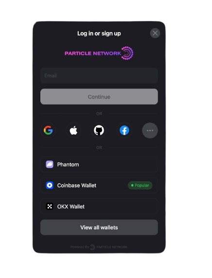
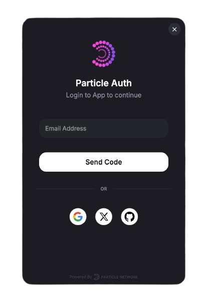

<Frame>
  
</Frame>

## Particle’s Onboarding SDKs

Particle Network provides two onboarding SDKs designed for different use cases:
	- Particle Connect → Unified modal for Web3 wallets + social logins, with built-in Account Abstraction (AA) support.
	- Particle Auth → Social login only, binding a Web2 identity (Google, Apple, Twitter, etc.) to an EOA wallet, with customizable UI.

Both can integrate with the AA SDK for smart account features.

***

Which one should I pick?
	- Use Connect if:
	- You want one modal that covers both wallet connections and social logins.
	- You need AA features ready out of the box via the built-in viem provider.
	- You’re fine with a standardized modal UI (limited customization).
	- Use Auth if:
	- You only need social logins and want to provide users with an instant wallet.
	- You want full control over the UI and the ability to embed login directly into your app’s flow.
	- You’re building a Web2-style onboarding with a branded experience.

***

### Particle Connect

<Frame caption="Particle Connect Login Modal">
  
</Frame>

Particle Connect gives you a unified login modal where users can choose between Web3 wallets or social logins. It includes a built-in viem provider with AA features, making smart account transactions possible without extra setup.

<CardGroup cols={1}>
  <Card title="Particle Connect Introduction" icon="plug" href="/api-reference/connect/introduction" />
  <Card title="Quickstart (Web)" icon="rocket" href="/api-reference/guides/wallet-as-a-service/waas/connect/web-quickstart" />
  <Card title="Web SDK Reference" icon="code" href="/api-reference/connect/desktop/web" />
</CardGroup>

***

### Particle Auth

<Frame caption="Particle Auth Login Modal">
  
</Frame>

Particle Auth focuses on social logins only, provisioning an EOA wallet for the user and abstracting key management. Unlike Connect, it allows deep UI customization so you can tailor the login flow and embed it directly in your app. Pair it with the AA SDK to enable smart accounts.

<CardGroup cols={1}>
  <Card title="Particle Auth Introduction" icon="user" href="/api-reference/auth/introduction" />
  <Card title="Quickstart (Web)" icon="rocket" href="/api-reference/guides/wallet-as-a-service/waas/auth/web-quickstart" />
  <Card title="Web SDK Reference" icon="code" href="/api-reference/auth/desktop-sdks/web" />
</CardGroup>

***

### Additional Resources

<CardGroup cols={3}>
  <Card title="Customization" icon="paintbrush" href="/social-logins/configuration/appearance/auth" />
  <Card title="Dashboard" icon="table-columns" href="/social-logins/dashboard" />
  <Card title="Network Coverage" icon="map" href="/social-logins/network-coverage" />
</CardGroup>
